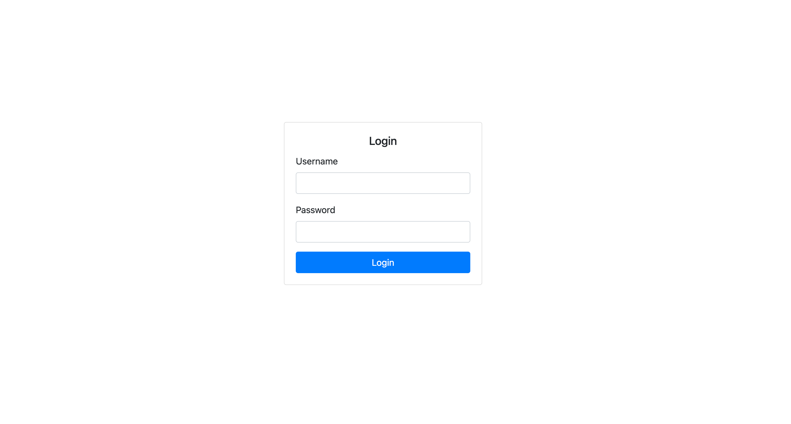
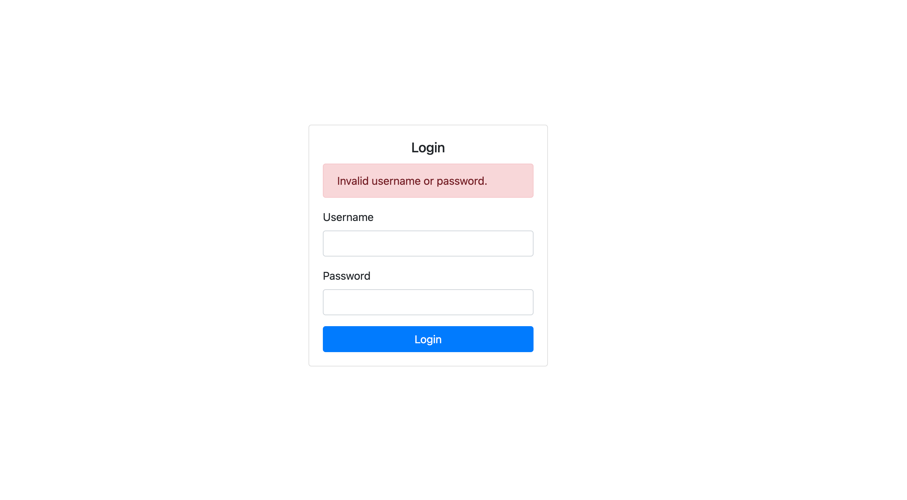
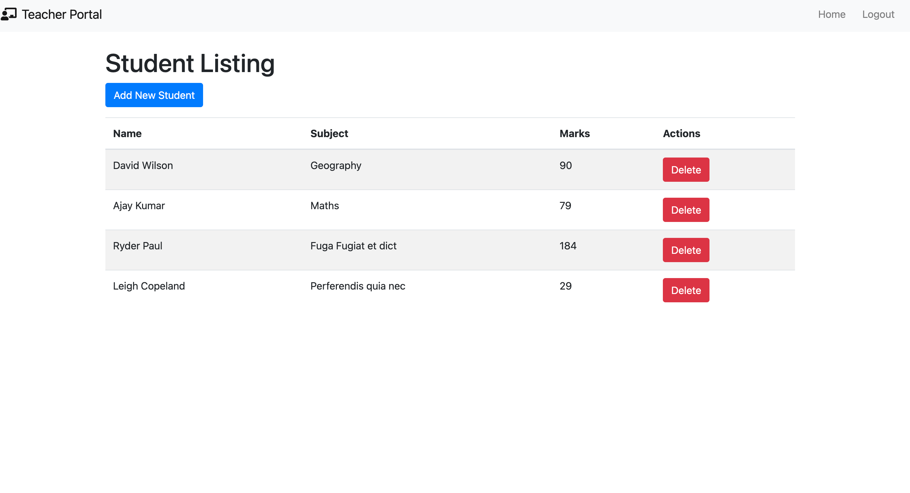
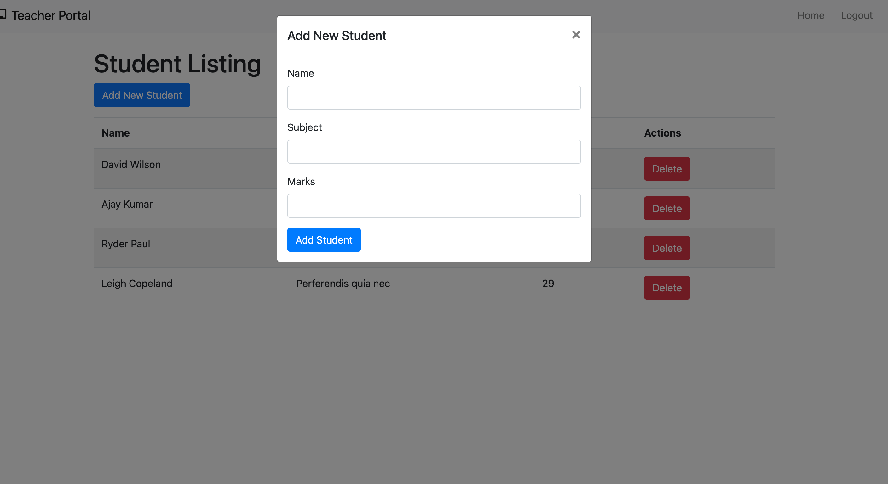

# Teacher Portal

The Teacher Portal is a web application that allows teachers to manage student information, including adding new students and updating their details.

## Features

- **Student Listing**: View a list of students with their names, subjects, and marks.
- **Inline Editing**: Edit student details directly in the table.
- **Add New Student**: Add new student records through a modal form.

## Technologies Used

- **Frontend**: HTML, CSS, Bootstrap 4.5, JavaScript
- **Backend**: PHP
- **Database**: MySQL
## Installation

### Prerequisites

- PHP (7.4 or higher)
- MySQL

### Setup

1. **Clone the Repository**

   ```bash
   git clone https://github.com/yourusername/teacher-portal.git
   cd teacher-portal


# snapshots
Teacher login form

Teacher login Erro form

Dashboard page

Add Student
